# 基于Vue+NodeJs的小米商城

## 前言

这是我使用Vue和NodeJs进行实战的一个项目，我选择了小米商城进行仿制，我从2023年8月份开始制作，断断续续做了很久现在做的差不多了，分享出来希望带给大家启发！目前项目还有不少bug和待完善功能，欢迎大家批评指正。

> 本项目参考了[小海同学](https://github.com/hai-27)的[Store（参考小米商城）
](https://github.com/hai-27/vue-store/tree/master)


> 本项目前后端分离，前端基于Vue仿制[小米商城](www.mi.com) 实现，后端代码已上传至仓库[vue_xiaomi_store_backend](https://github.com/hai-27/store-server)

> 项目通过腾讯云部署到了 [http://123.207.79.116/](http://123.207.79.116/) （移动端和桌面端都已适配），欢迎大家访问！


> 我正在学习前端，会不定期的更新完善该项目，日后可能更换技术栈（比如现在是基于Vue2，日后可能基于Vue3）。如果您发现问题欢迎在Issue或是在我博客评论区留言！

> 如果您喜欢这个项目请点击右上角⭐支持一下， 谢谢！


## 项目简介

前端基于
- Vue2
- Vuex
- Vue-Router
- Bootstrap
- Swiper

后端基于

- NodeJs
- Express框架
- Mysql

网站静态资源爬取

- NodeJs
- cheerio
- Selenium

前端页面根据功能主要分为主页，商品详情，购物车，个人中心。

## 运行项目

```
1. Clone project

git clone https://github.com/Septemus/vue_xiaomi_store.git

2. Project setup

cd vue_xiaomi_store
npm i

3. Compiles and hot-reloads for development

npm run serve

4. Compiles and minifies for production

npm run build
```


## 页面截图

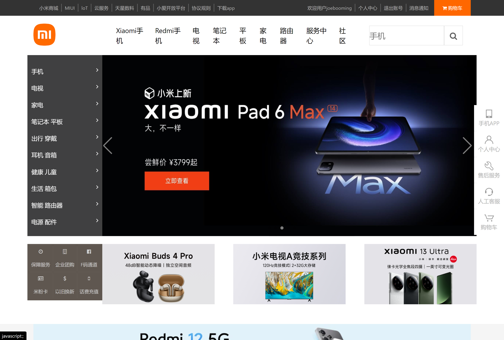
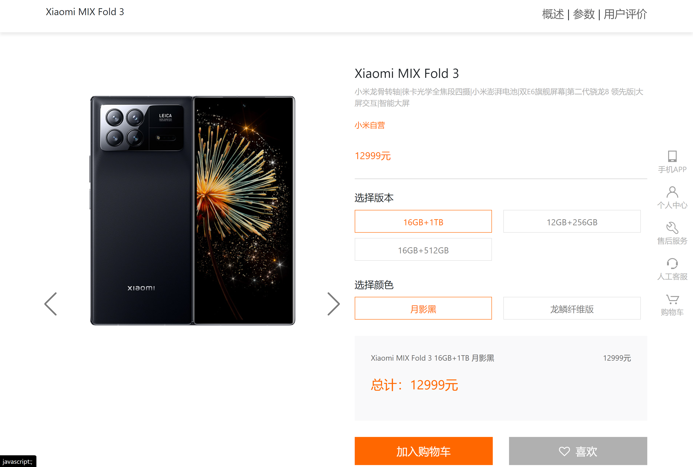
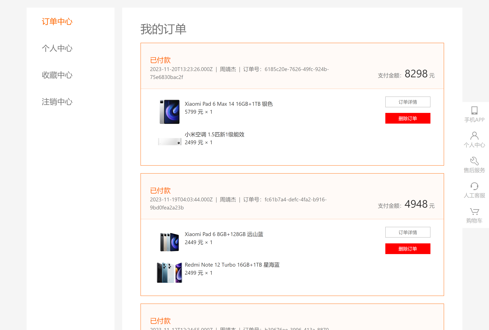
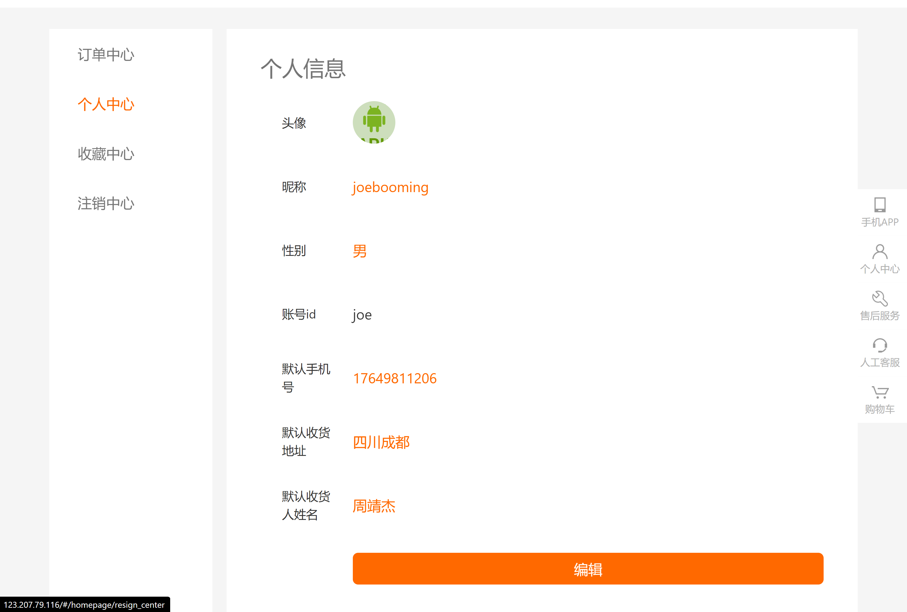
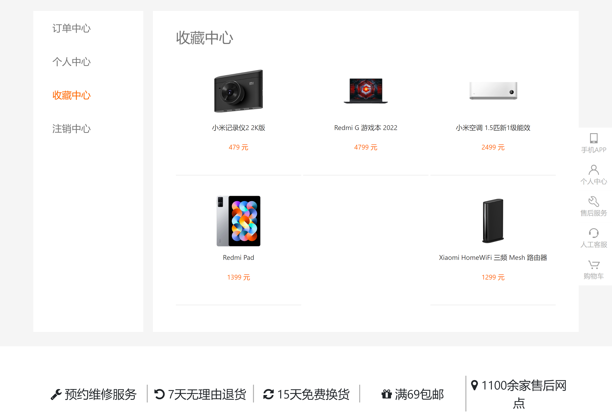
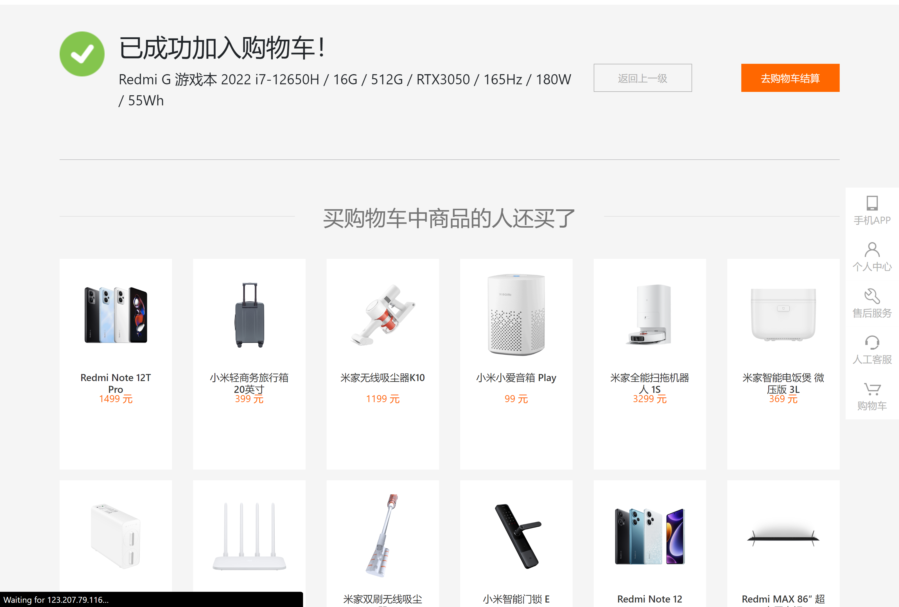
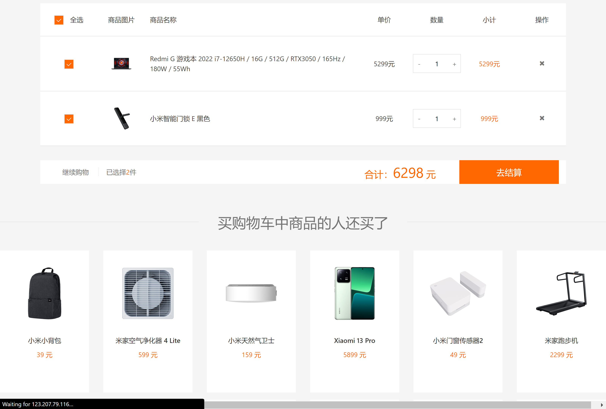
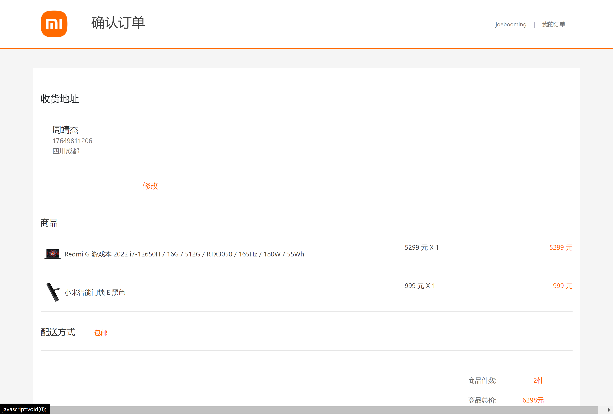
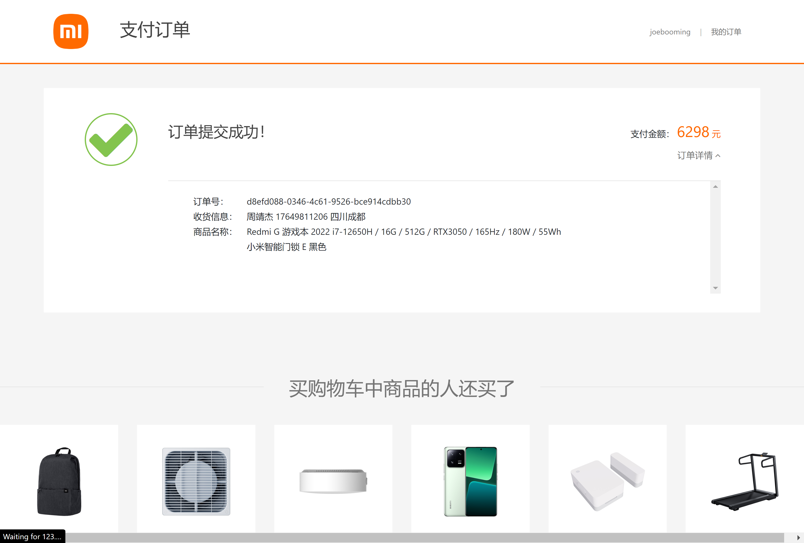
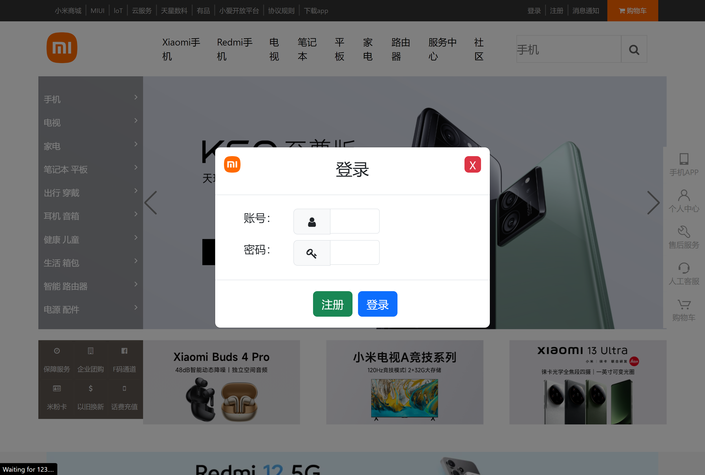
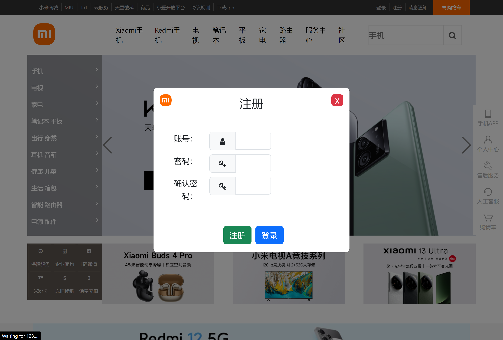
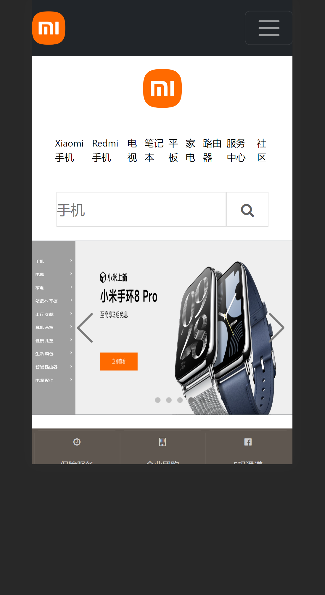
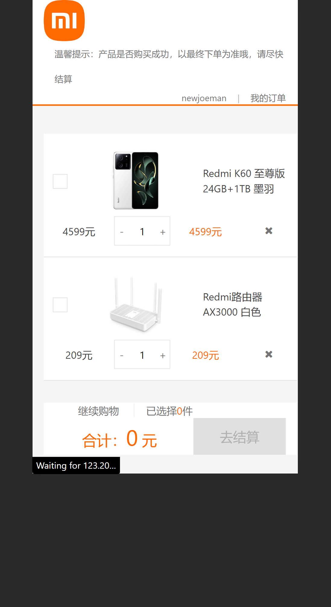
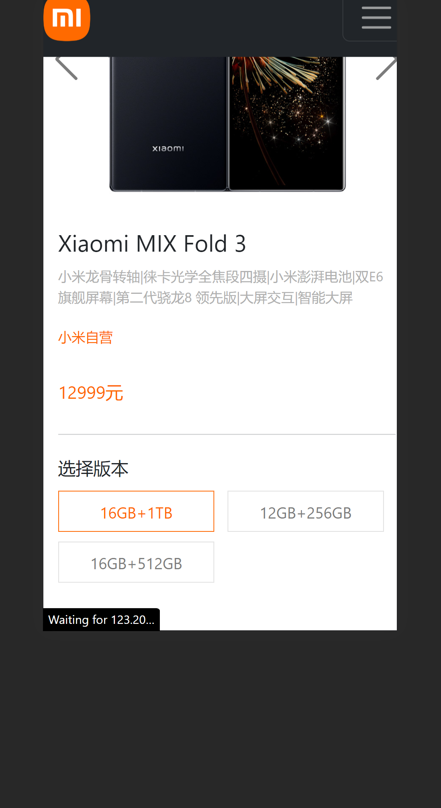
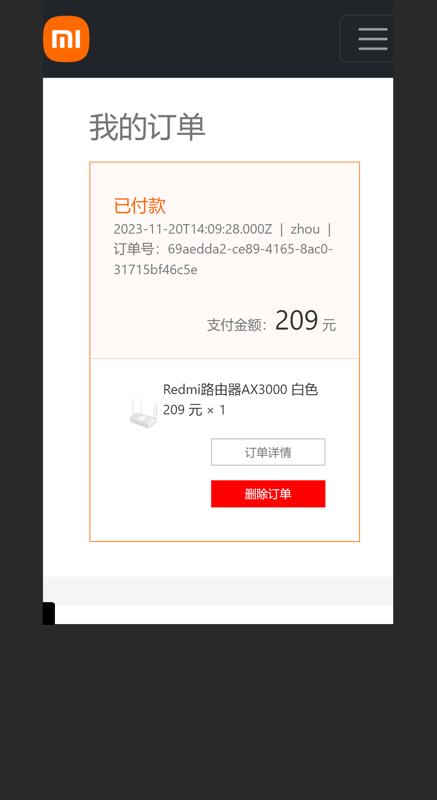
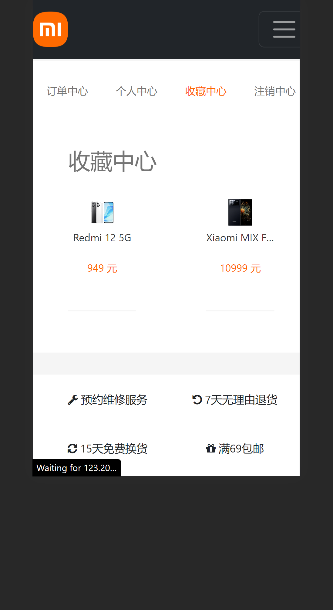


